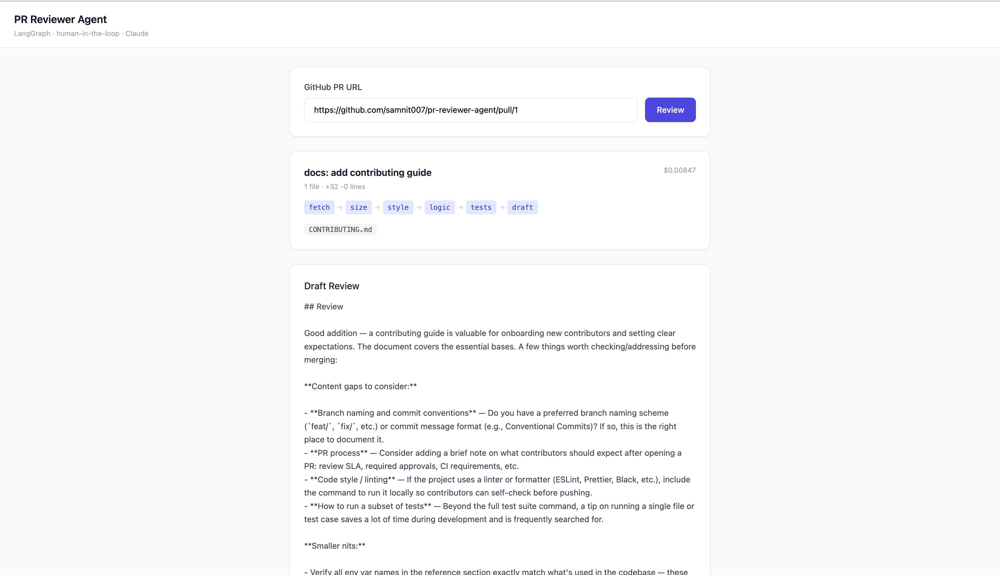
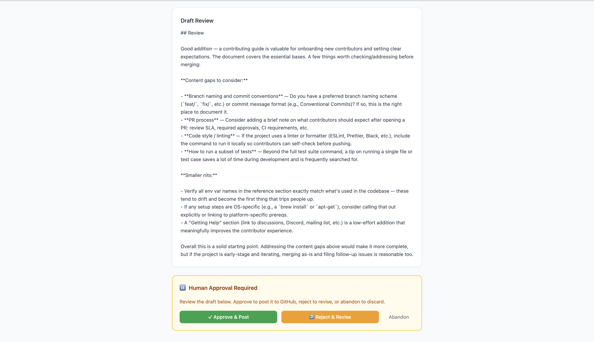
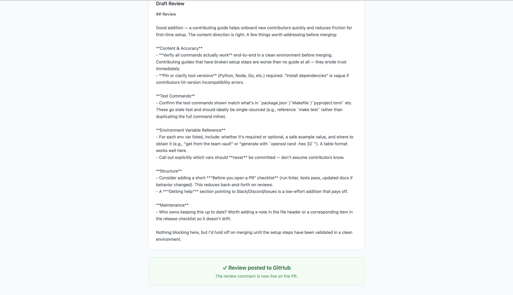

# PR Reviewer Agent

> A LangGraph agent that reviews GitHub pull requests — fetches the diff, analyses style, logic, and test coverage through specialised nodes, drafts a review, then pauses for **human approval** before posting to GitHub.

**Live demo:** https://pr-reviewer-agent.vercel.app

## How it works

Paste any public GitHub PR URL. The agent runs a multi-node pipeline, produces a draft review, then waits for you to approve, reject (with feedback for revision), or abandon.

```
START → fetch_pr → analyse_size
                       ↓               ↓
                 (large PR)      (normal PR)
                 summarise_only  check_style → check_logic → check_tests
                       ↓               ↓
                   draft_review ←──────┘
                       ↓
             ⏸ HUMAN APPROVAL CHECKPOINT
              ↙          ↓          ↘
         approved      rejected    abandoned
            ↓             ↓            ↓
      post_comment      revise        END
            ↓             ↓
           END      draft_review (loop)
```

- **Large PRs** (>500 lines) skip deep analysis and get a high-level summary instead
- **Rejected** reviews loop back through revision with your feedback
- **Approved** reviews post a real comment to the GitHub PR via the API

## Screenshots

### Draft review with node pipeline


### Human approval checkpoint


### Posted confirmation


## Stack

| Layer | Choice |
|---|---|
| Agent orchestration | LangGraph `StateGraph` + `MemorySaver` checkpointing |
| LLM — fast nodes | Claude Haiku (style, tests, size analysis) |
| LLM — high-stakes nodes | Claude Sonnet (logic, draft review, revision) |
| GitHub integration | PyGithub — fetch diff, post review comments |
| Backend | FastAPI |
| Frontend | Vue 3 + TypeScript + Tailwind CSS |
| Backend deploy | Railway |
| Frontend deploy | Vercel |

## Run locally

### Backend

```bash
cd backend
python -m venv venv && source venv/bin/activate
pip install -r requirements.txt
cp .env.example .env   # fill in keys (see below)
uvicorn app.main:app --reload --port 8000
```

### Frontend

```bash
cd frontend
npm install
npm run dev            # http://localhost:5174
```

Vite proxies `/api` → `localhost:8000` automatically.

## Environment variables

### Backend (`backend/.env`)

| Variable | Required | Description |
|---|---|---|
| `ANTHROPIC_API_KEY` | Yes | Anthropic API key |
| `GITHUB_TOKEN` | Yes | GitHub personal access token (needs `repo` scope to post comments) |
| `FAST_MODEL` | No | Defaults to `claude-haiku-4-5-20251001` |
| `SMART_MODEL` | No | Defaults to `claude-sonnet-4-6` |

### Frontend (Vercel env var)

| Variable | Description |
|---|---|
| `VITE_API_BASE` | Full backend URL e.g. `https://your-app.railway.app/api` |

## Key design decisions

**Why LangGraph?** The review pipeline is naturally a DAG with conditional branching (large vs normal PR) and a mid-graph interrupt for human approval. LangGraph's `interrupt_after` + `MemorySaver` handles state persistence between the two API calls cleanly.

**Why two models?** Style and test checks are mechanical — Haiku is fast and cheap. Logic analysis and draft synthesis require more reasoning — Sonnet earns its cost there.

**Human-in-the-loop** The graph pauses at `draft_review` via `interrupt_after`. The frontend stores the `run_id`, lets the user decide, then the backend calls `graph.update_state()` + `graph.invoke(None)` to resume from the checkpoint.
